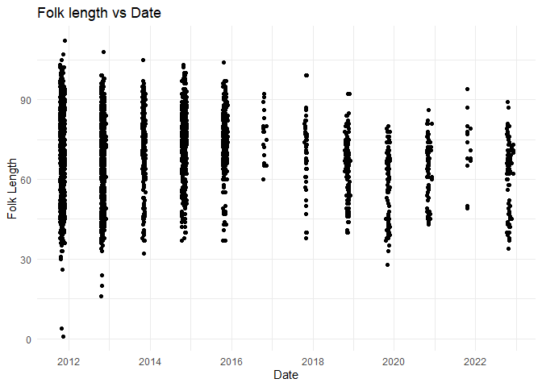

Klamath escapement data qc
================
Badhia Yunes Katz
09/24/2024

# Klamath River basin - Salmon River Carcass Mark Recapture Survey Data

The goal of this markdown is to:

1)  identify what types of data are included,
2)  data quality,
3)  resolve quality issues where we can,
4)  make data more usable

## Description of Monitoring Data

Upper Salmon River Carcass Mark Recapture Spawning Grounds Surveys.
Located on the Upper Salmon River (above Nordheimer Campground),
including Upper Mainstem, and North and South Forks of the Salmon River
and tributaries.

**Timeframe:** 2011-10-14 to 2022-12-09

**Completeness of Record throughout timeframe:** data collected only
during months of Oct-December

**Sampling Location:** Upper Salmon River Carcass Mark Recapture
Spawning Grounds Surveys. Located on the Upper Salmon River (above
Nordheimer Campground), including Upper Mainstem, and North and South
Forks of the Salmon River and tributaries.

**Data Contact:** [Dan Troxel](mailto::dan.troxel@wildlife.ca.gov)

Any additional info?

## Access Data

Read in data shared by Morgan Knechtle, but publicly available at
[California Open Data
Portal](https://data.ca.gov/dataset/fall-chinook-escapement-klamath-basin-watershed)

## Data transformations

``` r
# combining years
recapture <- bind_rows(salmon_river_recapture_11, salmon_river_recapture_12, salmon_river_recapture_13, salmon_river_recapture_14, salmon_river_recapture_15, salmon_river_recapture_16, salmon_river_recapture_17, salmon_river_recapture_18, salmon_river_recapture_19, salmon_river_recapture_20, salmon_river_recapture_21, salmon_river_recapture_22)
```

## Explore Numeric Variables:

``` r
# Filter clean data to show only numeric variables 
recapture |> 
  select_if(is.numeric) |> 
  colnames()
```

    ## [1] "path"    "fl"      "tag_app" "recap"

Temporal coverage

``` r
range(recapture$date)
```

    ## [1] "2011-10-14 UTC" "2022-12-09 UTC"

### Variable: `path`

1-Fresh, 2-Not Fresh, 3-Recapture, 4-Unretrievable

**Plotting path over Period of Record**

``` r
# Make whatever plot is appropriate 
ggplot(recapture, aes(date, path)) +
  geom_point()
```

<!-- -->

``` r
ggplot(recapture, aes(x = path)) +
  geom_bar() +
  labs(title = "Count of Observations per Path", x = "Path", y = "Count") +
  theme_minimal()
```

<!-- -->

``` r
ggplot(recapture, aes(x = path)) +
  geom_bar() +
  facet_wrap(~year(date)) +
  labs(title = "Count of Observations per Path", x = "Path", y = "Count") +
  theme_minimal()
```

<!-- -->

``` r
ggplot(recapture, aes(x = month(date, label = TRUE), fill = path)) + 
  geom_bar() +
  facet_wrap(~year(date)) +
  labs(x = "Month", y = "Count", title = "Distribution of Paths by Month Across Years") +
  theme_minimal()
```

<!-- -->

``` r
# maybe 2+ plots are appropriate
```

**Numeric Summary of path over Period of Record**

``` r
# Table with summary statistics
summary(recapture$path)
```

    ##    Min. 1st Qu.  Median    Mean 3rd Qu.    Max.    NA's 
    ##   1.000   1.000   2.000   1.939   2.000   4.000      35

**NA and Unknown Values**

There are 35 NA values

### Variable: `fl`

**Plotting path over Period of Record**

``` r
range(recapture$fl, na.rm = TRUE)
```

    ## [1]   1 632

``` r
ggplot(recapture, aes(date, fl)) + #noticing one outlier
  geom_point()
```

<!-- -->

``` r
# removing outlier and plotting again

recapture |> 
  filter(fl <600) |> 
  ggplot(aes(date, fl)) + 
  geom_point() +
  labs(x = "Date", y = "Folk Length", title = "Folk length vs Date") +
  theme_minimal()
```

<!-- -->

``` r
# remonving fl outlier
recapture <- recapture |> 
  mutate(fl = ifelse(fl > 600, NA, fl)) 

range(recapture$fl, na.rm = TRUE)
```

    ## [1]   1 112

``` r
recapture |> 
ggplot(aes(x = fl)) + 
  geom_histogram(breaks=seq(0, 200, by=2)) + 
  scale_x_continuous(breaks=seq(0, 200, by=25)) +
  theme_minimal() +
  labs(title = "Fork length distribution") + 
  theme_minimal() 
```

<!-- -->

``` r
recapture |> 
  mutate(sex = case_when(sex %in% c("F", "f") ~ "female",
                         sex %in% c("M", "m") ~ "male",
                         sex %in% c(46, "N", "U", "Y",NA) ~ "unknown")) |> 
  ggplot(aes(x = sex, y = fl)) +
  geom_boxplot() +
  # facet_wrap(~disposition) +
  theme_minimal() + 
  labs(y = "fork length (mm)", x = "sex")
```

<!-- -->

``` r
# recapture |> 
#   ggplot(aes(x = sex, y = fl)) + # sex seems to have more than M and F. Will check this below
#   geom_bar()
```

**Numeric Summary of path over Period of Record**

``` r
# Table with summary statistics
summary(recapture$fl)
```

    ##    Min. 1st Qu.  Median    Mean 3rd Qu.    Max.    NA's 
    ##    1.00   60.00   73.00   70.42   81.00  112.00    1056

**NA and Unknown Values**

There are 1056 NA values

### Variable: `tag_app`

“unique tag \# attached to carcass upon first encounter”

**Plotting path over Period of Record**

``` r
recapture |> 
  ggplot(aes(date, tag_app)) +
  geom_point()
```

<!-- -->

``` r
#TODO - think of another plot
```

**NA and Unknown Values**

There are 3862 NA values

### Variable: `recap`

“unique tag \# of tag on carcass during recapture”

**Plotting path over Period of Record**

``` r
recapture |> 
  ggplot(aes(date, recap)) +
  geom_point()
```

<!-- -->

``` r
#TODO - think of another plot
```

**NA and Unknown Values**

There are 5240 NA values

## Explore Categorical variables:

General notes: If there is an opportunity to turn yes no into boolean do
so, but not if you loose value

``` r
# Filter clean data to show only categorical variables
recapture |>  select_if(is.character) |>  colnames()
```

    ## [1] "sex"      "spawn"    "clips"    "headtag"  "rel_chop"

### Variable: `sex`

``` r
table(recapture$sex) # f - female, m - male, not sure what others are
```

    ## 
    ##   46    f    F    m    M    N    U    Y 
    ##    1  122 2459   59 2457    1    1    2

Fix inconsistencies with spelling, capitalization, and abbreviations.

``` r
# Fix any inconsistencies with categorical variables
recapture <- recapture |> #check if this assumption makes sense
  mutate(sex = case_when(
    sex %in% c("F", "f") ~ "female",
    sex %in% c("M", "m") ~ "male",
    sex %in% c(46, "N", "U", "Y") ~ "unknown"
  )) 
  # Create the plot
  ggplot(recapture, aes(x = month(date, label = TRUE), fill = sex)) +
  geom_bar() +
  facet_wrap(~year(date)) +
  theme_minimal() + 
  labs(y = "Count", x = "Month", title = "Total Counts of Each Sex Type by Month") +
  scale_fill_manual(values = c("female" = "pink", "male" = "lightblue", "unknown" = "gray")) +
  theme(axis.text.x = element_text(angle = 45, hjust = 1))
```

<!-- -->

**Create lookup rda for \[variable\] encoding:**

``` r
# Create named lookup vector
# Name rda [watershed]_[data type]_[variable_name].rda
# save rda to data/ 
```

**NA and Unknown Values**

There are 976 NA values

### Variable: `spawn`

``` r
table(recapture$spawn) # will assume T - Blank #TODO check if this is ok
```

    ## 
    ##    n    N    T    y    Y 
    ##    4   73    2  131 2516

``` r
#Y-yes, N-no, or blank
```

Fix inconsistencies with spelling, capitalization, and abbreviations.

``` r
# Fix any inconsistencies with categorical variables
recapture <- recapture |> 
    mutate(spawn = case_when(
    spawn %in% c("Y", "y") ~ "yes",
    spawn %in% c("N", "n") ~ "no",
    spawn == "T" ~ "blank" # TODO, assuming T - blank, check if this is true
  ))

recapture |> 
  ggplot(aes(x = month(date), fill = spawn)) +
  facet_wrap(~year(date), scales = "free") +
  geom_bar(position = "dodge", na.rm = FALSE) +
  scale_x_continuous(breaks = 1:12, labels = month.abb) +  
  labs(x = "Month", y = "Count", title = "Side-by-Side Counts by Spawn Type Across Months and Years") +
  theme_minimal()
```

<!-- -->

``` r
recapture |> 
  ggplot(aes(spawn, fl)) +
  geom_boxplot()
```

<!-- -->

**Create lookup rda for \[variable\] encoding:**

``` r
# Create named lookup vector
# Name rda [watershed]_[data type]_[variable_name].rda
# save rda to data/ 
```

**NA and Unknown Values**

There are 3352 NA values

### Variable: `clips`

description of hatchery marks - e.g. fin clip, jaw clip

``` r
table(recapture$clips) #TODO figure out what this means 
```

    ## 
    ##    M    N   N1    Y 
    ##    4 4167    1    1

Fix inconsistencies with spelling, capitalization, and abbreviations.

``` r
# Fix any inconsistencies with categorical variables
```

**Create lookup rda for \[variable\] encoding:**

``` r
# Create named lookup vector
# Name rda [watershed]_[data type]_[variable_name].rda
# save rda to data/ 
```

**NA and Unknown Values**

There are 1905 NA values

### Variable: `headtag`

``` r
table(recapture$headtag) # there are only two values, not worth qc'ing
```

    ## 
    ## 18921 95717 
    ##     1     1

**NA and Unknown Values**

There are 6076 NA values

### Variable: `rel_chop`

release or re-released tagged fish, or chopped untagged fish

``` r
table(recapture$rel_chop)
```

    ## 
    ##    c    C    r    R   RC 
    ##   34 1185  157 1879    1

Fix inconsistencies with spelling, capitalization, and abbreviations.

``` r
# Fix any inconsistencies with categorical variables
recapture <- recapture |> 
    mutate(rel_chop = case_when(
    rel_chop %in% c("c", "C") ~ "chop",
    rel_chop %in% c("r", "R") ~ "re-released",
    rel_chop == "RC" ~ "unknown" 
  )) 
```

**Create lookup rda for \[variable\] encoding:**

``` r
# Create named lookup vector
# Name rda [watershed]_[data type]_[variable_name].rda
# save rda to data/ 
```

**NA and Unknown Values**

There are 2822 NA values

## Summary of identified issues

- List things that are funky but that we don’t feel like should be
  changed without more investigation

## Save cleaned data back to /data folder

``` r
# Write to /data folder
# Name file [watershed]_[data type].csv
```
