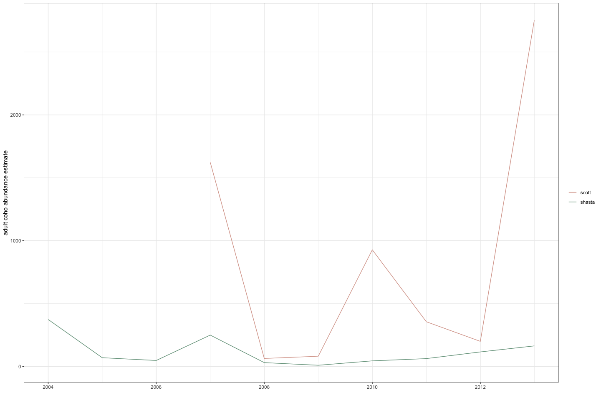
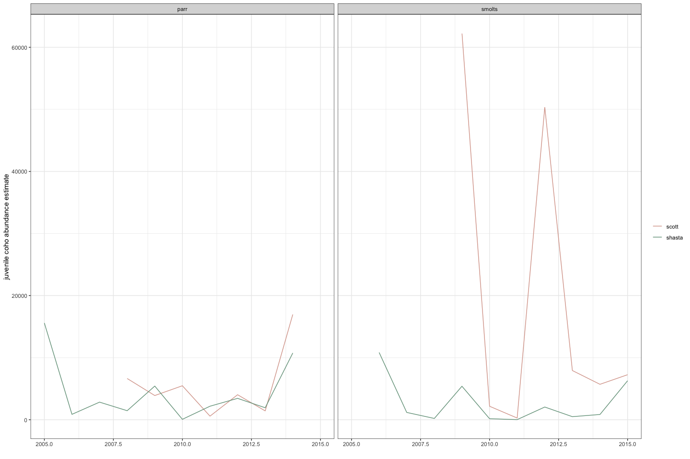

Modeled Coho Population Data
================
Ashley Vizek
December 2024

The purpose of this markdown is to give an overview of the dataset
including specific data types, temporal coverage, and geographic
coverage. This document is helpful in developing schemas to bring
together disparate datasets and exploring data limitations.

# Overview

**Data type:** Juvenile and adult Coho abundance estimates for Scott and
Shasta

These data were scraped from a US Fish and Wildlife Service Technical
Report using the Tabula software where you import a PDF and select a
table to export:

[Manhard, C. V., N. A. Som, R. W. Perry, J. R. Faukner, and T. Soto.
2018. Estimating freshwater productivity, overwinter survival, and
migration patterns of Klamath River Coho Salmon. U.S. Fish and Wildlife
Service. Arcata Fish and Wildlife Office, Arcata Fisheries Technical
Report Number TR 2018-33, Arcata,
California.](https://www.fws.gov/sites/default/files/documents/EstimatingFreshwaterProductivityOverwinterSurvivalandMigrationPatternsofKlamathRiverCohoSalmon.pdf)

We acquired these data because they were referenced in the [S3 Coho
model report](https://pubs.usgs.gov/of/2022/1071/ofr20221071.pdf) as
inputs.

## Data Available

**Annual adult abundance**

- Higher adult abundance in Scott
- Larger variation in abundance across years in Scott
- Longer time series in Shasta

**Annual juvenile abundance**

- Higher smolt abundance in Scott
- Large variation in smolt abundance across years in Scott
- Parr abundance is similar in Shasta and Scott (assume less parr caught
  in traps?)

### Scott and Shasta Coho spawner abundance

- Title: Annual abundance estimates for Scott and Shasta Coho spawners
- Spatial extent: Scott and Shasta rivers
- Description: The Scott River, Shasta River, and Bogus Creek fish
  counting facilities are located 29.3, 0.2, and 0.5 kilometers upstream
  of their respective stream mouths (Figure 1). Each facility uses a
  temporary, Alaskan-style weir to direct fish into a flume where they
  are monitored by a video camera. Facilities are typically operated 24
  hours a day, seven days a week from October through December and
  generally capture most of the Coho Salmon spawning migration. However,
  high discharge levels necessitate early removal of the weir in some
  years, potentially resulting in underestimates of spawner abundance.
  Annual abundance estimates of adult Coho Salmon were derived from
  direct counts of fish observed at the video counting facility.
  Further, spawning ground surveys were conducted on the Scott River to
  account for fish spawning in the 29.3 kilometers below the weir. Redd
  counts made downstream of the weir were multiplied by two and then
  added to the count from the video facility to yield an annual
  abundance estimate. This method assumes a 1:1 sex ratio, one female
  per redd, and 100% observer efficiency. It was not possible to confirm
  that these assumptions were met, based on information presented the
  CDFW technical reports.
- Temporal extent and resolution: 2004-2013, annual
- Fields included: stream, adult_year, weir_removed, spawners
- Name of data file: spawners.csv

**Data processing implications:**

**Questions:**

- How do you know when it is considered early to remove the weir and
  therefore estimates would be an underestimate?
- Is interpolation used when weir is removed early?
- Are redd data integrated in these estimates?

**Action items:** - Try to find a more updated table with data through
present - Try to find if these data are available in other locations

#### Data summary

This section may (or may not) explore every variable in the dataset. It
will include high level summaries of the data to communicate the primary
story of the data.

<!-- -->

### Scott and Shasta Coho juvenile abundance

- Title: Annual abundance estimates for Scott and Shasta Coho juveniles
- Spatial extent: Scott and Shasta rivers
- Description: Surveys of age-0+ (parr) and age-1+ (smolts) Coho Salmon
  emigrating from the Scott River have been conducted by CDFW since 2001
  (Chesney and Knechtle 2016; Knechtle and Chesney 2016). Annual
  juvenile abundances were estimated from raw counts of fish captured in
  rotary screw traps located on the Scott and Shasta Rivers, 7.6 km and
  0.1 km upstream of their respective confluences with the Klamath
  River. In most years, trap efficiencies were estimated from a
  mark-recapture framework and then used to estimate abundances from raw
  counts (Carlson et al. 1998). In years where inadequate numbers of
  Coho Salmon were captured or marked to estimate independent trap
  efficiencies, correlations between capture efficiencies of juvenile
  Coho Salmon and juvenile steelhead trout from prior years were instead
  used to estimate abundance. We estimated the freshwater productivity
  models with annual estimates of parr and smolt abundance in the Scott
  and Shasta Rivers, and we estimated the parr and smolt emigration
  timing models with weekly abundance estimates for each life stage.
- Temporal extent and resolution: 2004-2013, annual
- Fields included: year, estimation_method, juvenile_abundance,
  lifestage, stream
- Name of data file: juvenile.csv

**Data processing implications:**

**Questions:**

- What method is used to expand catch using trap efficiencies?
- What is meant by “correlations with steelhead trout”?
- How is catch expanded for days when the trap was not running?
- Are there uncertainty estimates around these numbers?

**Action items:** - Try to find a more updated table with data through
present - Try to find if these data are available in other locations

#### Data summary

This section may (or may not) explore every variable in the dataset. It
will include high level summaries of the data to communicate the primary
story of the data.

<!-- -->
