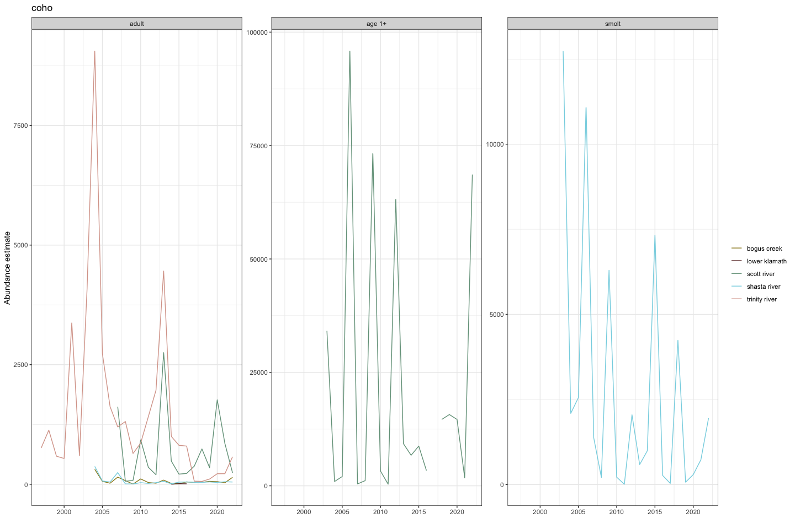
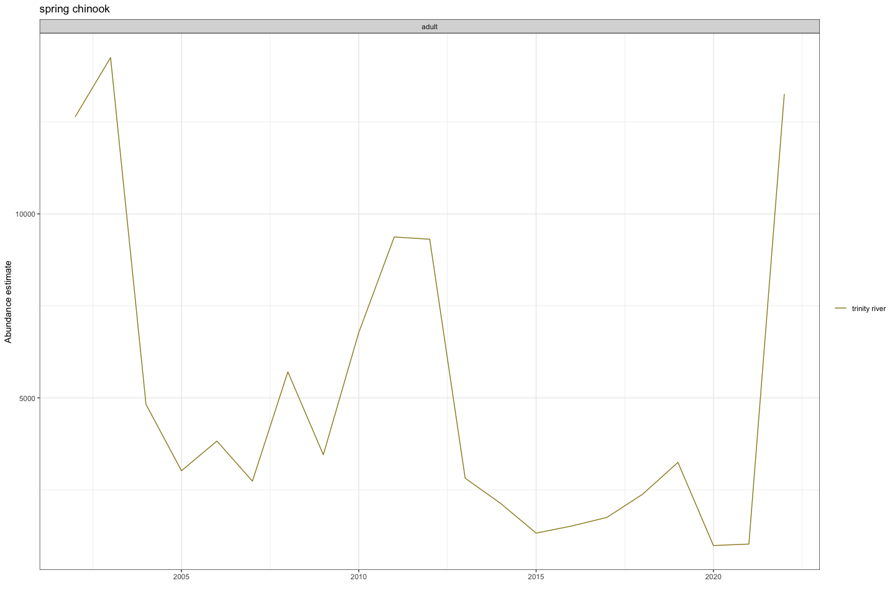
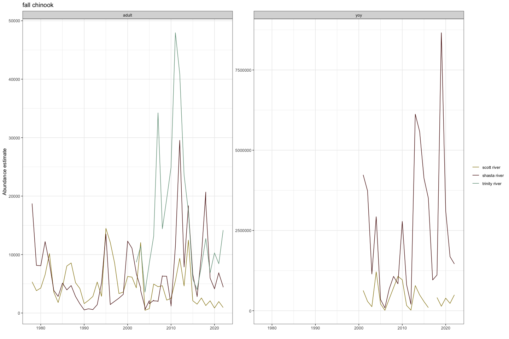
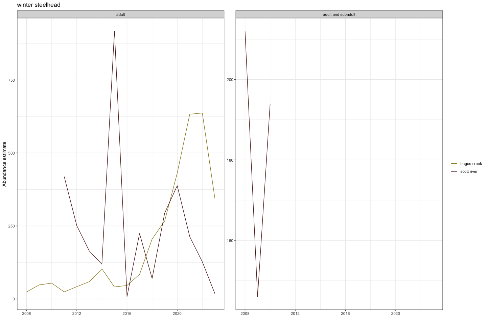
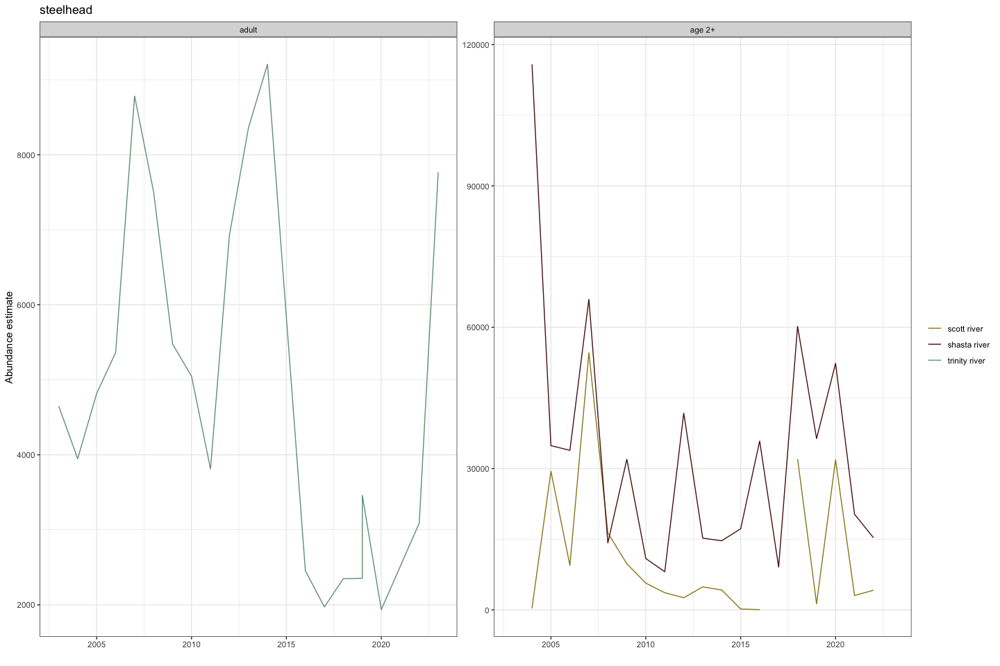
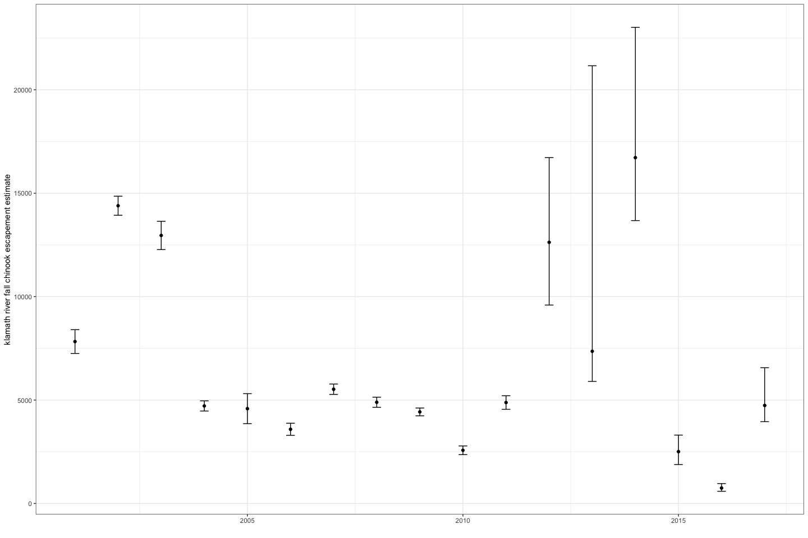
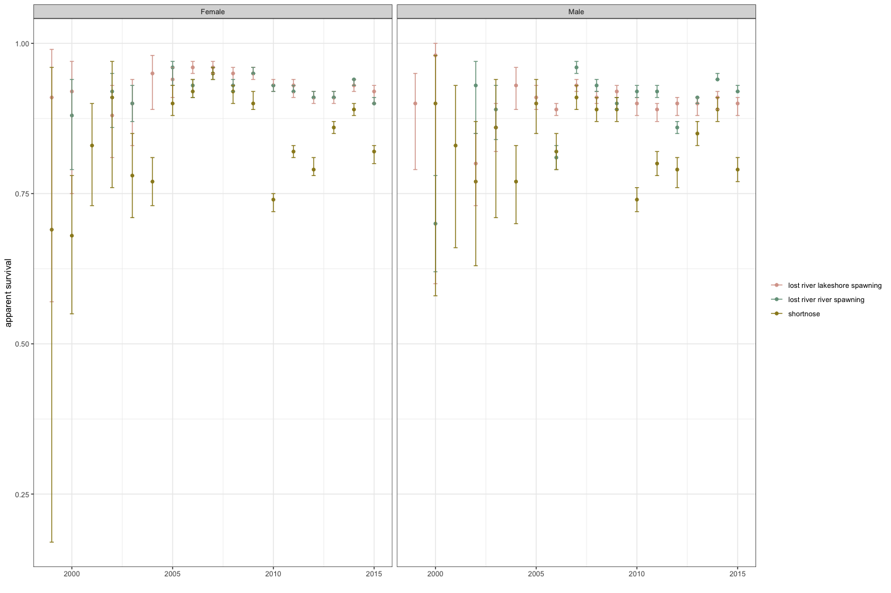
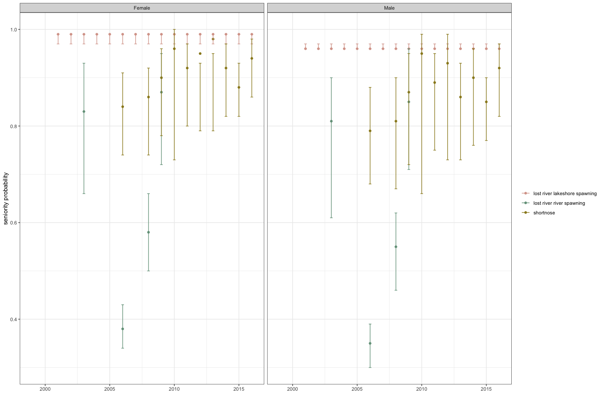
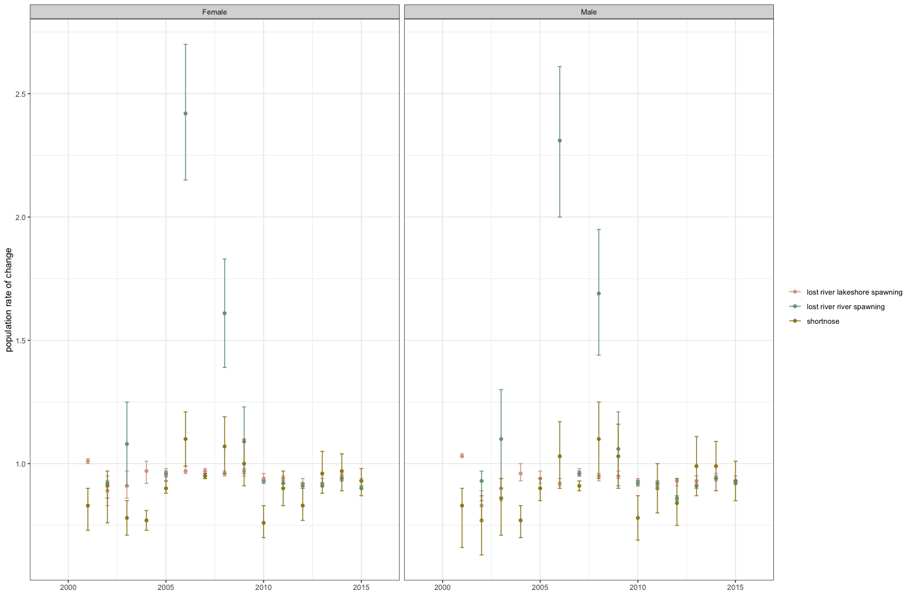

Modeled Fisheries Data
================
Ashley Vizek
March 2025

The purpose of this markdown is to give an overview of the dataset
including specific data types, temporal coverage, and geographic
coverage. This document is helpful in developing schemas to bring
together disparate datasets and exploring data limitations.

# Overview

**Data type:** modeled fisheries data

These data will ultimately be part of the
[klamathFishData](https://github.com/Klamath-SDM/klamathFishData) R
package. This document summarizes data from a number of sources.

## Salmonid Population Data from CDFW

This dataset spans watersheds throughout California. We filtered to
Trinity River, Scott River, Shasta River, Lower Klamath, and Klamath
River.

- Populations included: Bogus Creek, Lower Klamath, Scott River, Shasta
  River, Trinity River
- Species included: coho, steelhead, chinook
- Runs included: winter, fall, spring
- Lifestage included: adult, YOY, age 1+, age 2+, adult and subadult,
  smolt

Note that this is a synthesis spreadsheet and not the original source of
data. - Coho data for the Scott and Shasta can also be found: [Manhard,
C. V., N. A. Som, R. W. Perry, J. R. Faukner, and T. Soto. 2018.
Estimating freshwater productivity, overwinter survival, and migration
patterns of Klamath River Coho Salmon. U.S. Fish and Wildlife Service.
Arcata Fish and Wildlife Office, Arcata Fisheries Technical Report
Number TR 2018-33, Arcata,
California.](https://www.fws.gov/sites/default/files/documents/EstimatingFreshwaterProductivityOverwinterSurvivalandMigrationPatternsofKlamathRiverCohoSalmon.pdf)

- Title: Salmonid population data from CDFW
- Spatial extent: Bogus Creek, Lower Klamath, Scott River, Shasta River,
  Trinity River
- Description: The California Monitoring Plan (CMP) salmonid monitoring
  data provides a summary of salmonid population metrics and
  corresponding authors or sources. This information was updated during
  the fall and winter of 2023 and includes select data from 1978 through
  2023 but is not considered comprehensive. The population metrics
  summarized are focused on the viable salmonid population (VSP) key
  characteristics: abundance, productivity, and spatial structure. It is
  not recommended for users to extract data and make inferences without
  appropriately reviewing the associated source document(s). This
  dataset does not include data for all existing or past monitoring
  programs. The term “steelhead” is used in the Species field but does
  not confirm an anadromous life history. “Steelhead” values and
  estimates should be conservatively interpreted as Oncorhynchus mykiss
  (Steelhead or rainbow trout) and further investigated using the Source
  field in each record. Please read Salmonid Population Monitoring Data
  Description_CMP2021 for more information.
- Temporal extent and resolution: 1978-2023, annual (varies by location
  and species)
- Fields included: ID, Watershed, Population, Species, Life Stage,
  Origin, Run designation, Brood Year, Survey season, Sample method,
  Estimation method, Metric, Population parameter, Value, X95 lower CI,
  X95 upper CI, Full population estimate, Temporally limited, Spatially
  limited, Notes, Source, ESU_DPS, CDFW region, GEO_ID_POLY, GEO_ID_PT
- Name of data file: Salmonid_Population_Monitoring_Data_CMPv2023.xlsx
- Source: These data were downloaded from California Department of Fish
  and Wildlife (CDFW) [document
  library](https://www.nrm.dfg.ca.gov/documents/ContextDocs.aspx?cat=Fisheries--AnadromousSalmonidPopulationMonitoring)

**Data processing implications:**

- column names to snake case
- transform to format outlined in schema

**Questions:**

- how are these data different than estimates gathered previously
  (e.g. scott and shasta coho): they are the same but these data are
  more up to date so use these
- where do these data come from? where are the methods?

**Action items:**

### Data summary

This section may (or may not) explore every variable in the dataset. It
will include high level summaries of the data to communicate the primary
story of the data.

<!-- --><!-- --><!-- --><!-- --><!-- -->

## Klamath Fall Chinook escapement

- Title: Annual escapement estimates for Klamath River fall Chinook
- Spatial extent: mainstem Klamath River
- Description: Adult fall Chinook Salmon carcasses and redds were
  surveyed on the mainstem Klamath River, from Iron Gate Dam to Wingate
  Bar during the 2017 spawning season to estimate annual escapement and
  characterize the age and sex composition and spawning success of the
  run. Surveys were conducted over 9 weeks, from October 11 to
  December 6. Using postmortem mark–recapture methods and a hierarchical
  latent variables model between Iron Gate Dam and the confluence with
  the Shasta River, the estimated spawning escapement for this 21.6-km
  section of the mainstem Klamath River was 4,740 fish.
- Temporal extent and resolution: 2001-2017, annual
- Fields included: Year, estimate, Lower Upper, Estimator
- Name of data file: fall_chinook_escapement.csv
- Source: These data were scraped from a US Fish and Wildlife Service
  Technical Report using the Tabula software where you import a PDF and
  select a table to export:

[Gough, S. A., C. Z. Romberger, and N. A. Som. 2018. Fall Chinook Salmon
Run Characteristics and Escapement in the Mainstem Klamath River below
Iron Gate Dam, 2017. U.S. Fish and Wildlife Service. Arcata Fish and
Wildlife Office, Arcata Fisheries Data Series Report Number DS 2018–58,
Arcata,
California](https://www.fws.gov/sites/default/files/documents/2017%20klamath%20spawn%20survey%20report%202017%20FINAL1.pdf)

**Data processing implications:**

- Need to split the lower and upper bounds
- Tranform character to numeric
- Clean up the column names

**Questions:** - What is going on in the years with high uncertainty

**Action items:** - Try to find a more updated table with data through
present - Try to find if these data are available in other locations

### Data summary

This section may (or may not) explore every variable in the dataset. It
will include high level summaries of the data to communicate the primary
story of the data.

<!-- -->

## Adult sucker survival

- Title: Annual adult survival estimates for Lost River and Shortnose
  suckers in Upper Klamath Lake
- Spatial extent: Upper Klamath Lake
- Description:
- Temporal extent and resolution: 1999-2016, annual
- Fields included: sex, year, population, apparent_survival_estimate,
  apparent_survival_SE, apparent_survival_CI,
  seniority_probability_estimate, seniority_probability_SE,
  seniority_probability_CI, annual_population_rate_of_change_estimate,
  annual_population_rate_of_change_SE,
  annual_population_rate_of_change_CI
- Name of data file: sucker_survival.csv
- Source: These data were scraped from a USGS Technical Report using the
  Tabula software where you import a PDF and select a table to export:

[Hewitt, D.A., Janney, E.C., Hayes, B.S., and Harris, A.C., 2018, Status
and trends of adult Lost River (Deltistes luxatus) and shortnose
(Chasmistes brevirostris) sucker populations in Upper Klamath Lake,
Oregon, 2017: U.S. Geological Survey Open-File Report 2018-1064, 31 p.,
https://doi.org/10.3133/ofr20181064.](https://pubs.usgs.gov/of/2018/1064/ofr20181064.pdf)

The raw data associated with this report are available; however, we
decided to focus on the modeled output first. Ultimately we envision
pulling in raw survival data from the KBFC PIT tag database.

**Data processing implications:**

- Remove estimates labelled “B” or “C”
- Split the CI into the low/high bounds
- We could add this to other modelled data

**Questions:**

- I thought the population of declining but population change shows
  small increase

**Action items:**

### Data summary

This section may (or may not) explore every variable in the dataset. It
will include high level summaries of the data to communicate the primary
story of the data.

<!-- --><!-- --><!-- -->

## Save data

Data files are stored on AWS
