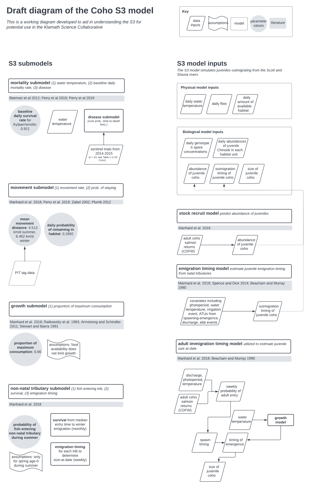

```{r setup, include=FALSE}
library(tidyverse)

theme_set(theme_bw())

knitr::opts_chunk$set(echo = TRUE)
```

## Model Diagram



## FISH

S3 allows for inputs of fish from tributary or hatchery sources.

The fish input is mapped to the model domain using the 'Unit Number' identifying the habitat unit at which to add fish (`FISH$UnitNum`). These inputs can be stratified by brood year, run type, and life stage. Fish inputs are required to have an average length (in mm) and weight (in g).

Simulations in S3 are stratified by 'source populations' which are individual groups of fish to be tracked. `FISH$Source` and `FISH$runType` are combined within S3 to define the 'source populations'. Inputs are also stratified by time, discritized into weeks of the year by `FISH$first_Rdate` and `FISH$last_Rdate`. These columns define the starting date and ending dat of each week. The abundance of fish each week is defined using the `FISH$Total_released` column and these individuals are spread evenly across the week.

```{r include=FALSE}
load('data/FISH.rda') 

FISH <- FISH |> 
  mutate(first_Rdate = lubridate::as_date(first_Rdate),
         last_Rdate = lubridate::as_date(last_Rdate)) 

```

```{r}

FISH |> 
  head() |> 
  knitr::kable()

```

*...with `r nrow(FISH) - 10` additional rows*

**UnitNum**

There are `r length(unique(FISH$UnitNum))` unique unit numbers in the `FISH` dataset

```{r}
summary(FISH$UnitNum)

unique(FISH$UnitNum)
```

**Source**

```{r}
unique(FISH$Source)
```

**runType**

The only run type is `FACH`

*TODO* get definition

```{r}
unique(FISH$runType)
```

**Total_released**

*TODO* question - data seems inconsistent temporally and the range from 1980-2000 vs. 2000 to 2005

```{r}
summary(FISH$Total_released)
```

```{r}
FISH |> 
  ggplot() + 
  geom_line(aes(x = first_Rdate , y = Total_released))

FISH |> 
  ggplot() + 
  geom_line(aes(x = last_Rdate , y = Total_released))

```

**avg_length**

```{r}
summary(FISH$avg_length)

FISH |> 
  ggplot() + 
  geom_line(aes(x = first_Rdate , y = avg_length))

```

**avg_weight**

```{r}
summary(FISH$avg_weight)

FISH |> 
  ggplot() + 
  geom_line(aes(x = first_Rdate , y = avg_weight))

```

**brood_year**

```{r}
summary(FISH$brood_year)

FISH |> 
  group_by(brood_year) |> 
  summarize(n = length(brood_year)) |> 
  ggplot() + 
  geom_col(aes(x = brood_year, y = n))

```

**first_Rdate and last_Rdate**

```{r}
summary(FISH$first_Rdate)

summary(FISH$last_Rdate)

```

## FLOWS

```{r include = FALSE}
load('data/FLOWS.rda')

FLOWS <- FLOWS |> 
  mutate(Date = lubridate::as_date(Date)) 
```

```{r}
FLOWS |> 
  head() |> 
  knitr::kable()

```

*...with `r nrow(FLOWS) - 10` additional rows*

**Date**

```{r}
summary(FLOWS$Date)
```

**Location**

```{r}
unique(FLOWS$Location)
```

**Location_km**

```{r}
summary(FLOWS$Location_km)
```

**Flow**

```{r}
FLOWS |> 
  ggplot() + 
  geom_line(aes(x = Date, y = Flow)) + 
  facet_wrap(~Location)
```

## HABAREA

```{r include = FALSE}
load('data/HABAREA.rda')
```

Weighted Useable Area (WUA data). This dataset contains WUA estimates.

One of the fundamental concepts of S3 is that daily discharge influences available habitat for different life stages, which in turn drives density-dependent processes that affect population dynamics. The model requires a *H* by *T* matrix of available habitat areas or a *H* by *T* matrix of habitat capacities for each life stage.

The structure of S3 gives users the flexibility to define habitat area or capacity using a wide variety of techniques. For examples see:

-   [Perry et al. 2018](https://doi.org/10.3133/ofr20181174) - Trinity River Habitat Capacity
-   [Perry et al. 2019](https://doi.org/10.3133/ofr20191107) - Klamath River WUA

`HABAREA` contains either the WUA or capacity estimates and is structured by habitat units `HABAREA$UnitNum`. Other inputs include `HABAREA$Flow_cfs`, defining the flows (cfs), and estimates of area for various life stages or spawning.

| Data       | Description                     |
|------------|---------------------------------|
| UnitNum    | Habitat unit number             |
| Flow_cfs   | Discharge (cfs)                 |
| totArea_m2 | Total area unit (meters\^2)     |
| spn_m2     | Spawning area (meters\^2)       |
| fry_m2     | Fry area (meters\^2)            |
| juv_m2     | Parr and smolt area (meters\^2) |

```{r}
HABAREA |> head() |> knitr::kable()
```

*...with `r nrow(HABAREA) - 10` additional rows*

**UnitNum**

*TODO* are these unit numbers the same as those in `FISH`? This dataset contains sequential unit numbers from 1 to 2635

```{r}
summary(HABAREA$UnitNum)
```

**FLow_cfs**

```{r}
summary(HABAREA$Flow_cfs)

HABAREA |> 
  ggplot() + 
  geom_line(aes(x = UnitNum, y = Flow_cfs))
```

**totArea_m2**

```{r}
summary(HABAREA$totArea_m2)

HABAREA |> 
  ggplot() + 
  geom_line(aes(x = UnitNum, y = totArea_m2))
```

**spn_m2**

```{r}
summary(HABAREA$spn_m2)

HABAREA |> 
  ggplot() + 
  geom_line(aes(x = UnitNum, y = spn_m2))
```

**fry_m2**

```{r}
summary(HABAREA$fry_m2)

HABAREA |> 
  ggplot() + 
  geom_line(aes(x = UnitNum, y = fry_m2))
```

**juv_m2**

```{r}
summary(HABAREA$juv_m2)

HABAREA |> 
  ggplot() + 
  geom_line(aes(x = UnitNum, y = juv_m2))
```

## HABITAT

| Data    | Description                                |
|---------|--------------------------------------------|
| UnitNum | Habitat unit number                        |
| rkm.up  | River kilometer - upper bound of unit (km) |

```{r include = FALSE}
load('data/HABITAT.rda')
```

```{r}
HABITAT |> head() |> knitr::kable()
```

*...with `r nrow(HABITAT) - 10` additional rows*

**UnitNum**

`UnitNum` aligns perfectly with `HABAREA`

```{r}
summary(HABITAT$UnitNum)

any(unique(HABITAT$UnitNum) == unique(HABAREA$UnitNum))
```

**rkm.up**

```{r}
summary(HABITAT$rkm.up)

HABITAT |> 
  ggplot() + 
  geom_histogram(aes(x = rkm.up))

```

## SPAWNERS

To simulate the spatiotemporal distribution of emerging fry from natural production, information from spawning surveys can be incorporated into S3. Spawning data is optional and not required (see `process_spawn()`).

Much like the `FISH` inputs spawning data is structured in weeks with `SPAWNERS$wk_start_date` and `SPAWNERS$wk_end_date` signifying the start and end of each week. The abundance of spawners (`SPAWNERS$Abundance`) is then distributed across days in each week. `SPAWNERS$wk.calendar` is the calendar week represented by each of the weeks and can be calculated using the S3 function `calWeek()`. `SPAWNERS$Reach` is used to map the number of spawning fish to locations (see `SPAWNLOC`). Simulating spawning dynamics is optional, therefore this input is optional.

```{r include = FALSE}
load('data/SPAWNERS.rda')
```

```{r}
SPAWNERS <- SPAWNERS |> 
  mutate(wk_start_date = lubridate::as_date(wk_start_date),
         wk_end_date = lubridate::as_date(wk_end_date))

SPAWNERS |> head() |> knitr::kable()
```

*...with `r nrow(SPAWNERS) - 10` additional rows*

**species**

```{r}
unique(SPAWNERS$species)
```

**Source**

```{r}
unique(SPAWNERS$Source)
```

**wk_start_date & wk_end_date**

```{r}
summary(SPAWNERS$wk_start_date)

summary(SPAWNERS$wk_end_date)
```

**wk.calendar**

```{r}
summary(SPAWNERS$wk.calendar)
```

**Reach**

```{r}
unique(SPAWNERS$Reach)
```

**Abundance**

```{r}
summary(SPAWNERS$Abundance)
```

## SPAWNLOC

Known spawning locations can be added to S3 (?SPAWNLOC). This information can be combined with spawner surveys (?SPAWNERS) to distribute spawners uniformly across available habitat.

This input is structured by defining reaches, each with a starting and ending river kilometer. The data structure has only three columns: `SPAWNLOC$Reach`, `SPAWNLOC$Start_rkm`, `SPAWNLOC$End_rkm`. Simulating spawning dynamics is optional, therefore this input is optional.

```{r include = FALSE}
load('data/SPAWNLOC.rda')
```

```{r}
SPAWNLOC |> head() |> knitr::kable()
```

*...with `r nrow(SPAWNLOC) - 10` additional rows*

**Reach**

```{r}
unique(SPAWNLOC$Reach)
```

**Start_rkm**

```{r}
min(SPAWNLOC$Start_rkm)
max(SPAWNLOC$Start_rkm)
```

**End_rkm**

```{r}
min(SPAWNLOC$End_rkm)
max(SPAWNLOC$End_rkm)
```

## SPOREDATA

To model disease dynamics, primarily C. Shasta in the Klamath, S3 incorporates spore concentration data (?SPOREDATA).

This input is structured as a time series of spore concentrations, with two columns: SPOREDATA$Date and SPOREDATA$spCon. Simulating disease dynamics is an option in S3, therefore this input is optional.

```{r include = FALSE}
load('data/SPOREDATA.rda')

SPOREDATA <- SPOREDATA |> 
  mutate(Date = lubridate::as_date(Date))
```

```{r}
SPOREDATA |> head() |> knitr::kable()
```

*...with `r nrow(SPOREDATA) - 10` additional rows*

**Date**

```{r}
summary(SPOREDATA$Date)
```

**spCon**

```{r}
summary(SPOREDATA$spCon)
```

```{r}
SPOREDATA |> 
  ggplot(aes(x = Date, y = spCon)) +
  geom_line()
```

## TEMPS

A dataset containing 50 year data set of historical temperatures from RBM10 historical simulation

| Data        | Description                                |
|-------------|--------------------------------------------|
| Date        | Date, format = yyyy-mm-dd                  |
| Location    | Name of location                           |
| Location_km | Location, river kilometers from mouth (km) |
| Temp        | Water temperature, degrees C               |

```{r include = FALSE}
load('data/TEMPS.rda')

TEMPS <- TEMPS |> 
  mutate(Date = lubridate::as_date(Date))
```

```{r}
TEMPS |> head() |> knitr::kable()
```

*...with `r nrow(TEMPS) - 10` additional rows*

**Date**

```{r}
summary(TEMPS$Date)
```

**Location**

```{r}
unique(TEMPS$Location)
```

**Location_km**

```{r}
min(TEMPS$Location_km)
max(TEMPS$Location_km)
```

**Temp**

```{r}
TEMPS |> 
  ggplot(aes(x = Date, y = Temp)) + 
  geom_line() + 
  facet_wrap(~Location)

```
