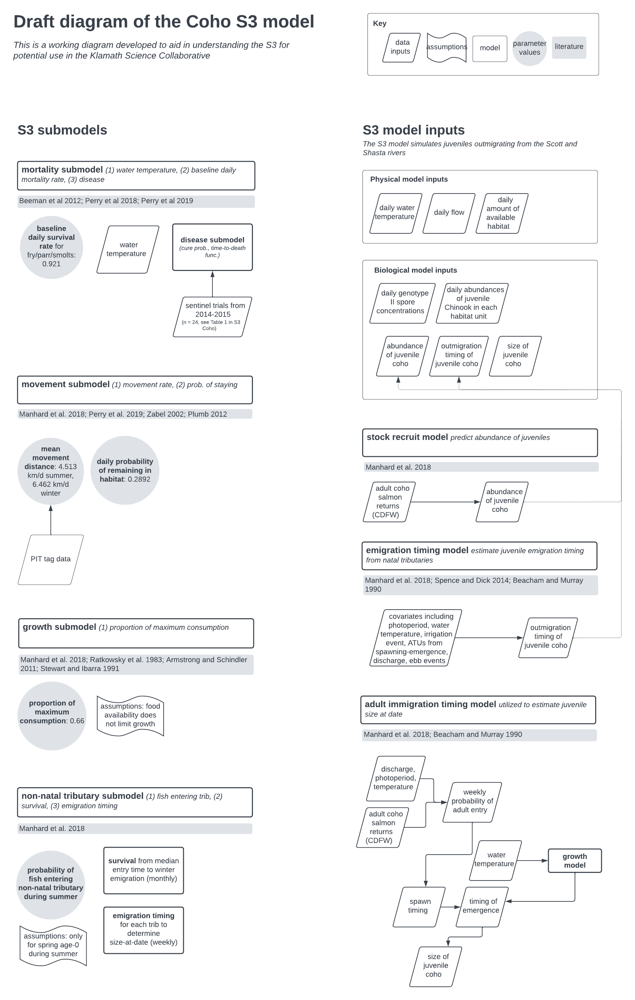
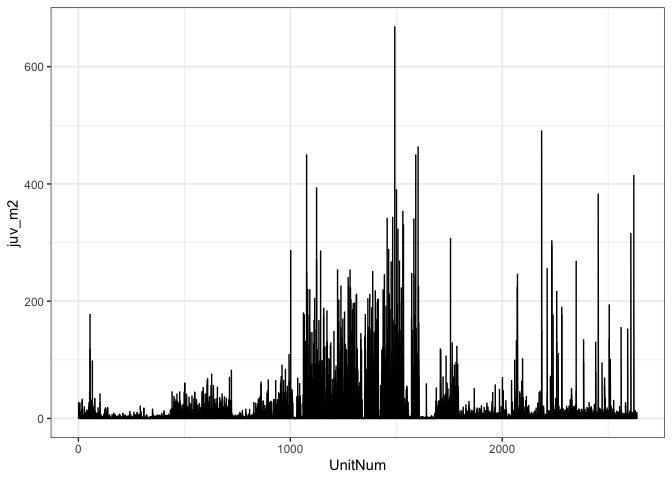

S3 Model Data Types Exploration
================
Maddee Rubenson (FlowWest)
2025-04-10

- [Model Diagram](#model-diagram)
- [FISH](#fish)
- [FLOWS](#flows)
- [HABAREA](#habarea)
- [HABITAT](#habitat)
- [SPAWNERS](#spawners)
- [SPAWNLOC](#spawnloc)
- [SPOREDATA](#sporedata)
- [TEMPS](#temps)

## Model Diagram

<figure>

<figcaption aria-hidden="true">Figure 1. Draft diagram of the S3 Coho
model to aid in understanding the S3 model as a resource for the Klamath
Basin Science Collaborative</figcaption>
</figure>

## FISH

S3 allows for inputs of fish from tributary or hatchery sources.

The fish input is mapped to the model domain using the ‘Unit Number’
identifying the habitat unit at which to add fish (`FISH$UnitNum`).
These inputs can be stratified by brood year, run type, and life stage.
Fish inputs are required to have an average length (in mm) and weight
(in g).

Simulations in S3 are stratified by ‘source populations’ which are
individual groups of fish to be tracked. `FISH$Source` and
`FISH$runType` are combined within S3 to define the ‘source
populations’. Inputs are also stratified by time, discritized into weeks
of the year by `FISH$first_Rdate` and `FISH$last_Rdate`. These columns
define the starting date and ending dat of each week. The abundance of
fish each week is defined using the `FISH$Total_released` column and
these individuals are spread evenly across the week.

``` r
FISH |> 
  head() |> 
  knitr::kable()
```

| UnitNum | Source | runType | Total_released | avg_length | avg_weight | brood_year | first_Rdate | last_Rdate |
|---:|:---|:---|---:|---:|---:|---:|:---|:---|
| 932 | Bogus Cr | FACH | 222816 | 39 | 0.5 | 2001 | 2002-03-24 | 2002-03-30 |
| 932 | Bogus Cr | FACH | 1112391 | 38 | 0.5 | 2001 | 2002-03-31 | 2002-04-06 |
| 932 | Bogus Cr | FACH | 1306329 | 39 | 0.5 | 2001 | 2002-04-07 | 2002-04-13 |
| 932 | Bogus Cr | FACH | 230956 | 41 | 0.6 | 2001 | 2002-04-14 | 2002-04-20 |
| 932 | Bogus Cr | FACH | 35273 | 42 | 0.7 | 2001 | 2002-04-21 | 2002-04-27 |
| 932 | Bogus Cr | FACH | 183328 | 42 | 0.7 | 2001 | 2002-04-28 | 2002-05-04 |

*…with 2788 additional rows*

**UnitNum**

There are 9 unique unit numbers in the `FISH` dataset

``` r
summary(FISH$UnitNum)
```

    ##    Min. 1st Qu.  Median    Mean 3rd Qu.    Max. 
    ##     930    1060    2133    1744    2308    2308

``` r
unique(FISH$UnitNum)
```

    ## [1]  932  930 1242 2205 2132 2133 1436 1060 2308

**Source**

``` r
unique(FISH$Source)
```

    ## [1] "Bogus Cr"  "IGH"       "Salmon R"  "Scott R"   "Shasta R"  "Trinity H"
    ## [7] "Trinity R"

**runType**

The only run type is `FACH`

*TODO* get definition

``` r
unique(FISH$runType)
```

    ## [1] "FACH"

**Total_released**

*TODO* question - data seems inconsistent temporally and the range from
1980-2000 vs. 2000 to 2005

``` r
summary(FISH$Total_released)
```

    ##     Min.  1st Qu.   Median     Mean  3rd Qu.     Max. 
    ##        0      811     5394   107927    32829 12204669

``` r
FISH |> 
  ggplot() + 
  geom_line(aes(x = first_Rdate , y = Total_released))
```

<!-- -->

``` r
FISH |> 
  ggplot() + 
  geom_line(aes(x = last_Rdate , y = Total_released))
```

<!-- -->

**avg_length**

``` r
summary(FISH$avg_length)
```

    ##    Min. 1st Qu.  Median    Mean 3rd Qu.    Max. 
    ##    5.00   47.00   58.00   62.16   78.00  158.00

``` r
FISH |> 
  ggplot() + 
  geom_line(aes(x = first_Rdate , y = avg_length))
```

<!-- -->

**avg_weight**

``` r
summary(FISH$avg_weight)
```

    ##    Min. 1st Qu.  Median    Mean 3rd Qu.    Max. 
    ##   0.000   1.000   2.000   3.523   5.400  59.900

``` r
FISH |> 
  ggplot() + 
  geom_line(aes(x = first_Rdate , y = avg_weight))
```

<!-- -->

**brood_year**

``` r
summary(FISH$brood_year)
```

    ##    Min. 1st Qu.  Median    Mean 3rd Qu.    Max. 
    ##    1979    2004    2008    2008    2012    2015

``` r
FISH |> 
  group_by(brood_year) |> 
  summarize(n = length(brood_year)) |> 
  ggplot() + 
  geom_col(aes(x = brood_year, y = n))
```

<!-- -->

**first_Rdate and last_Rdate**

``` r
summary(FISH$first_Rdate)
```

    ##         Min.      1st Qu.       Median         Mean      3rd Qu.         Max. 
    ## "1980-06-16" "2005-07-03" "2009-07-12" "2009-04-20" "2013-04-14" "2016-11-27"

``` r
summary(FISH$last_Rdate)
```

    ##         Min.      1st Qu.       Median         Mean      3rd Qu.         Max. 
    ## "1980-06-16" "2005-07-09" "2009-07-18" "2009-04-26" "2013-04-20" "2016-12-03"

## FLOWS

``` r
FLOWS |> 
  head() |> 
  knitr::kable()
```

| Date       | Location          | Location_km | Flow |
|:-----------|:------------------|------------:|-----:|
| 1960-10-01 | Klamath.Near.Keno |    378.2373 | 1050 |
| 1960-10-02 | Klamath.Near.Keno |    378.2373 | 1050 |
| 1960-10-03 | Klamath.Near.Keno |    378.2373 | 1050 |
| 1960-10-04 | Klamath.Near.Keno |    378.2373 | 1030 |
| 1960-10-05 | Klamath.Near.Keno |    378.2373 | 1020 |
| 1960-10-06 | Klamath.Near.Keno |    378.2373 | 1020 |

*…with 5.09438^{5} additional rows*

**Date**

``` r
summary(FLOWS$Date)
```

    ##         Min.      1st Qu.       Median         Mean      3rd Qu.         Max. 
    ## "1960-10-01" "1975-04-12" "1989-10-22" "1989-10-22" "2004-05-03" "2018-11-12"

**Location**

``` r
unique(FLOWS$Location)
```

    ##  [1] "Klamath.Near.Keno"                 "Klamath.Top.of.JC.Boyle.Reservoir"
    ##  [3] "Klamath.Below.JC.Boyle.PP"         "Klamath.Below.Copco1.Dam"         
    ##  [5] "Klamath.Below.Iron.Gate"           "Klamath.Willow"                   
    ##  [7] "Klamath.Cottonwood"                "Klamath.Shasta"                   
    ##  [9] "Klamath.Humbug"                    "Klamath.Beaver"                   
    ## [11] "Klamath.Dona"                      "Klamath.Horse"                    
    ## [13] "Klamath.Scott"                     "Klamath.Near.Seiad.Valley"        
    ## [15] "Klamath.Indian.Creek"              "Klamath.Elk"                      
    ## [17] "Klamath.Clear"                     "Klamath.Salmon"                   
    ## [19] "Klamath.At.Orleans"                "Klamath.Red.Cap"                  
    ## [21] "Klamath.Bluff"                     "Klamath.Trinity"                  
    ## [23] "Klamath.Blue"                      "Klamath.Near.Klamath"

**Location_km**

``` r
summary(FLOWS$Location_km)
```

    ##    Min. 1st Qu.  Median    Mean 3rd Qu.    Max. 
    ##   13.65  104.78  237.03  212.67  299.89  378.24

**Flow**

``` r
FLOWS |> 
  ggplot() + 
  geom_line(aes(x = Date, y = Flow)) + 
  facet_wrap(~Location)
```

<!-- -->

## HABAREA

Weighted Useable Area (WUA data). This dataset contains WUA estimates.

One of the fundamental concepts of S3 is that daily discharge influences
available habitat for different life stages, which in turn drives
density-dependent processes that affect population dynamics. The model
requires a *H* by *T* matrix of available habitat areas or a *H* by *T*
matrix of habitat capacities for each life stage.

The structure of S3 gives users the flexibility to define habitat area
or capacity using a wide variety of techniques. For examples see:

- [Perry et al. 2018](https://doi.org/10.3133/ofr20181174) - Trinity
  River Habitat Capacity
- [Perry et al. 2019](https://doi.org/10.3133/ofr20191107) - Klamath
  River WUA

`HABAREA` contains either the WUA or capacity estimates and is
structured by habitat units `HABAREA$UnitNum`. Other inputs include
`HABAREA$Flow_cfs`, defining the flows (cfs), and estimates of area for
various life stages or spawning.

| Data       | Description                    |
|------------|--------------------------------|
| UnitNum    | Habitat unit number            |
| Flow_cfs   | Discharge (cfs)                |
| totArea_m2 | Total area unit (meters^2)     |
| spn_m2     | Spawning area (meters^2)       |
| fry_m2     | Fry area (meters^2)            |
| juv_m2     | Parr and smolt area (meters^2) |

``` r
HABAREA |> head() |> knitr::kable()
```

| UnitNum | Flow_cfs | totArea_m2 |    spn_m2 |    fry_m2 |   juv_m2 |
|--------:|---------:|-----------:|----------:|----------:|---------:|
|       1 |        0 |      0.000 |    0.0000 |  0.000000 | 0.000000 |
|       1 |      206 |   1727.870 |  984.5681 | 10.117282 | 3.735946 |
|       1 |      249 |   1841.270 | 1057.2326 | 10.524197 | 3.959563 |
|       1 |      259 |   1687.338 |  983.0289 |  9.191307 | 3.590523 |
|       1 |      272 |   1676.386 |  982.5201 |  8.944078 | 3.551479 |
|       1 |      283 |   1720.930 | 1005.4288 |  9.108645 | 3.641905 |

*…with 2.6349^{5} additional rows*

**UnitNum**

*TODO* are these unit numbers the same as those in `FISH`? This dataset
contains sequential unit numbers from 1 to 2635

``` r
summary(HABAREA$UnitNum)
```

    ##    Min. 1st Qu.  Median    Mean 3rd Qu.    Max. 
    ##       1     659    1318    1318    1977    2635

**FLow_cfs**

``` r
summary(HABAREA$Flow_cfs)
```

    ##    Min. 1st Qu.  Median    Mean 3rd Qu.    Max. 
    ##       0    1285    2311    5617    5013  112901

``` r
HABAREA |> 
  ggplot() + 
  geom_line(aes(x = UnitNum, y = Flow_cfs))
```

<!-- -->

**totArea_m2**

``` r
summary(HABAREA$totArea_m2)
```

    ##    Min. 1st Qu.  Median    Mean 3rd Qu.    Max. 
    ##       0    2460    5399    9270   10980  375217

``` r
HABAREA |> 
  ggplot() + 
  geom_line(aes(x = UnitNum, y = totArea_m2))
```

<!-- -->

**spn_m2**

``` r
summary(HABAREA$spn_m2)
```

    ##    Min. 1st Qu.  Median    Mean 3rd Qu.    Max. 
    ##     0.0   289.2   816.5  1456.3  1838.9 43920.4

``` r
HABAREA |> 
  ggplot() + 
  geom_line(aes(x = UnitNum, y = spn_m2))
```

<!-- -->

**fry_m2**

``` r
summary(HABAREA$fry_m2)
```

    ##     Min.  1st Qu.   Median     Mean  3rd Qu.     Max. 
    ##    0.000    1.505    4.975   26.006   17.443 1873.547

``` r
HABAREA |> 
  ggplot() + 
  geom_line(aes(x = UnitNum, y = fry_m2))
```

<!-- -->

**juv_m2**

``` r
summary(HABAREA$juv_m2)
```

    ##     Min.  1st Qu.   Median     Mean  3rd Qu.     Max. 
    ##   0.0000   0.9164   3.8094  12.4849  12.1753 667.9280

``` r
HABAREA |> 
  ggplot() + 
  geom_line(aes(x = UnitNum, y = juv_m2))
```

<!-- -->

## HABITAT

| Data    | Description                                |
|---------|--------------------------------------------|
| UnitNum | Habitat unit number                        |
| rkm.up  | River kilometer - upper bound of unit (km) |

``` r
HABITAT |> head() |> knitr::kable()
```

| UnitNum |   rkm.up |
|--------:|---------:|
|       1 | 378.2373 |
|       2 | 378.1245 |
|       3 | 378.0398 |
|       4 | 377.9849 |
|       5 | 377.9602 |
|       6 | 377.8617 |

*…with 2625 additional rows*

**UnitNum**

`UnitNum` aligns perfectly with `HABAREA`

``` r
summary(HABITAT$UnitNum)
```

    ##    Min. 1st Qu.  Median    Mean 3rd Qu.    Max. 
    ##     1.0   659.5  1318.0  1318.0  1976.5  2635.0

``` r
any(unique(HABITAT$UnitNum) == unique(HABAREA$UnitNum))
```

    ## [1] TRUE

**rkm.up**

``` r
summary(HABITAT$rkm.up)
```

    ##     Min.  1st Qu.   Median     Mean  3rd Qu.     Max. 
    ##   0.3075 139.0462 251.7888 231.2842 331.9396 378.2373

``` r
HABITAT |> 
  ggplot() + 
  geom_histogram(aes(x = rkm.up))
```

    ## `stat_bin()` using `bins = 30`. Pick better value with `binwidth`.

<!-- -->

## SPAWNERS

To simulate the spatiotemporal distribution of emerging fry from natural
production, information from spawning surveys can be incorporated into
S3. Spawning data is optional and not required (see `process_spawn()`).

Much like the `FISH` inputs spawning data is structured in weeks with
`SPAWNERS$wk_start_date` and `SPAWNERS$wk_end_date` signifying the start
and end of each week. The abundance of spawners (`SPAWNERS$Abundance`)
is then distributed across days in each week. `SPAWNERS$wk.calendar` is
the calendar week represented by each of the weeks and can be calculated
using the S3 function `calWeek()`. `SPAWNERS$Reach` is used to map the
number of spawning fish to locations (see `SPAWNLOC`). Simulating
spawning dynamics is optional, therefore this input is optional.

``` r
SPAWNERS <- SPAWNERS |> 
  mutate(wk_start_date = lubridate::as_date(wk_start_date),
         wk_end_date = lubridate::as_date(wk_end_date))

SPAWNERS |> head() |> knitr::kable()
```

| species | Source  | wk_start_date | wk_end_date | wk.calendar | Reach   | Abundance |
|:--------|:--------|:--------------|:------------|------------:|:--------|----------:|
| FACH    | Klamath | 2001-08-26    | 2001-09-01  |          34 | Reach_1 |        NA |
| FACH    | Klamath | 2001-08-26    | 2001-09-01  |          34 | Reach_2 |        NA |
| FACH    | Klamath | 2001-08-26    | 2001-09-01  |          34 | Reach_3 |        NA |
| FACH    | Klamath | 2001-08-26    | 2001-09-01  |          34 | Reach_4 |        NA |
| FACH    | Klamath | 2001-08-26    | 2001-09-01  |          34 | Reach_5 |        NA |
| FACH    | Klamath | 2001-08-26    | 2001-09-01  |          34 | Reach_6 |        NA |

*…with 4163 additional rows*

**species**

``` r
unique(SPAWNERS$species)
```

    ## [1] "FACH"

**Source**

``` r
unique(SPAWNERS$Source)
```

    ## [1] "Klamath"

**wk_start_date & wk_end_date**

``` r
summary(SPAWNERS$wk_start_date)
```

    ##         Min.      1st Qu.       Median         Mean      3rd Qu.         Max. 
    ## "2001-08-26" "2005-09-11" "2009-11-01" "2009-10-24" "2013-12-01" "2017-12-24"

``` r
summary(SPAWNERS$wk_end_date)
```

    ##         Min.      1st Qu.       Median         Mean      3rd Qu.         Max. 
    ## "2001-09-01" "2005-09-17" "2009-11-07" "2009-10-30" "2013-12-07" "2017-12-30"

**wk.calendar**

``` r
summary(SPAWNERS$wk.calendar)
```

    ##    Min. 1st Qu.  Median    Mean 3rd Qu.    Max. 
    ##   34.00   38.00   43.00   42.99   48.00   52.00

**Reach**

``` r
unique(SPAWNERS$Reach)
```

    ##  [1] "Reach_1"  "Reach_2"  "Reach_3"  "Reach_4"  "Reach_5"  "Reach_6" 
    ##  [7] "Reach_7"  "Reach_8"  "Reach_9"  "Reach_10" "Reach_11" "Reach_12"
    ## [13] "Reach_13"

**Abundance**

``` r
summary(SPAWNERS$Abundance)
```

    ##    Min. 1st Qu.  Median    Mean 3rd Qu.    Max.    NA's 
    ##    0.00    6.00   21.09   58.80   66.00 1115.72    2781

## SPAWNLOC

Known spawning locations can be added to S3 (?SPAWNLOC). This
information can be combined with spawner surveys (?SPAWNERS) to
distribute spawners uniformly across available habitat.

This input is structured by defining reaches, each with a starting and
ending river kilometer. The data structure has only three columns:
`SPAWNLOC$Reach`, `SPAWNLOC$Start_rkm`, `SPAWNLOC$End_rkm`. Simulating
spawning dynamics is optional, therefore this input is optional.

``` r
SPAWNLOC |> head() |> knitr::kable()
```

| Reach | Start_rkm |  End_rkm |
|------:|----------:|---------:|
|     1 |  311.9765 | 311.4029 |
|     2 |  311.4029 | 308.5917 |
|     3 |  308.5917 | 307.4239 |
|     4 |  307.4239 | 305.1690 |
|     5 |  305.1690 | 302.4102 |
|     6 |  302.4102 | 297.3962 |

*…with 3 additional rows*

**Reach**

``` r
unique(SPAWNLOC$Reach)
```

    ##  [1]  1  2  3  4  5  6  7  8  9 10 11 12 13

**Start_rkm**

``` r
min(SPAWNLOC$Start_rkm)
```

    ## [1] 196.368

``` r
max(SPAWNLOC$Start_rkm)
```

    ## [1] 311.9765

**End_rkm**

``` r
min(SPAWNLOC$End_rkm)
```

    ## [1] 178.4202

``` r
max(SPAWNLOC$End_rkm)
```

    ## [1] 311.4029

## SPOREDATA

To model disease dynamics, primarily C. Shasta in the Klamath, S3
incorporates spore concentration data (?SPOREDATA).

This input is structured as a time series of spore concentrations, with
two columns: SPOREDATA$Date and SPOREDATA$spCon. Simulating disease
dynamics is an option in S3, therefore this input is optional.

``` r
SPOREDATA |> head() |> knitr::kable()
```

| Date       | spCon |
|:-----------|------:|
| 2004-08-14 |     0 |
| 2004-08-15 |     0 |
| 2004-08-16 |     0 |
| 2004-08-17 |     0 |
| 2004-08-18 |     0 |
| 2004-08-19 |     0 |

*…with 5244 additional rows*

**Date**

``` r
summary(SPOREDATA$Date)
```

    ##         Min.      1st Qu.       Median         Mean      3rd Qu.         Max. 
    ## "2004-08-14" "2008-03-19" "2011-10-23" "2011-10-23" "2015-05-28" "2019-01-01"

**spCon**

``` r
summary(SPOREDATA$spCon)
```

    ##     Min.  1st Qu.   Median     Mean  3rd Qu.     Max. 
    ##    0.000    0.000    0.100    9.122    3.403 1092.240

``` r
SPOREDATA |> 
  ggplot(aes(x = Date, y = spCon)) +
  geom_line()
```

<!-- -->

## TEMPS

A dataset containing 50 year data set of historical temperatures from
RBM10 historical simulation

| Data        | Description                                |
|-------------|--------------------------------------------|
| Date        | Date, format = yyyy-mm-dd                  |
| Location    | Name of location                           |
| Location_km | Location, river kilometers from mouth (km) |
| Temp        | Water temperature, degrees C               |

``` r
TEMPS |> head() |> knitr::kable()
```

| Date       | Location | Location_km | Temp |
|:-----------|:---------|------------:|-----:|
| 1980-01-01 | Keno_Dam |    378.2373 |  2.8 |
| 1980-01-02 | Keno_Dam |    378.2373 |  2.7 |
| 1980-01-03 | Keno_Dam |    378.2373 |  3.0 |
| 1980-01-04 | Keno_Dam |    378.2373 |  3.2 |
| 1980-01-05 | Keno_Dam |    378.2373 |  3.6 |
| 1980-01-06 | Keno_Dam |    378.2373 |  3.9 |

*…with 3.4699^{5} additional rows*

**Date**

``` r
summary(TEMPS$Date)
```

    ##         Min.      1st Qu.       Median         Mean      3rd Qu.         Max. 
    ## "1980-01-01" "1989-07-01" "1998-12-31" "1998-12-31" "2008-07-01" "2017-12-31"

**Location**

``` r
unique(TEMPS$Location)
```

    ##  [1] "Keno_Dam"                     "Upstream_end_of_JC_Boyle_Res"
    ##  [3] "JC_Boyle_Dam"                 "Copco_Dam"                   
    ##  [5] "Iron_Gate_Dam"                "Below_Bogus_Ck"              
    ##  [7] "Below_Willow_Ck"              "Below_Cottonwood_Ck"         
    ##  [9] "Below_Shasta_R"               "Below_Humbug_Ck"             
    ## [11] "Below_Beaver_Ck"              "Below_Dona_Ck"               
    ## [13] "Below_Horse_Ck"               "Below_Scott_R"               
    ## [15] "Seiad_Valley_gage"            "Below_Indian_Ck"             
    ## [17] "Below_Elk_Ck"                 "Below_Clear_Ck"              
    ## [19] "Below_Salmon_R"               "Orleans"                     
    ## [21] "Below_Red_Cap_Ck"             "Below_Bluff_Ck"              
    ## [23] "Below_Trinity_R"              "Below_Blue_Ck"               
    ## [25] "Klamath"

**Location_km**

``` r
min(TEMPS$Location_km)
```

    ## [1] 13.6511

``` r
max(TEMPS$Location_km)
```

    ## [1] 378.2373

**Temp**

``` r
TEMPS |> 
  ggplot(aes(x = Date, y = Temp)) + 
  geom_line() + 
  facet_wrap(~Location)
```

    ## Warning: Removed 3014 rows containing missing values or values outside the scale range
    ## (`geom_line()`).

<!-- -->
