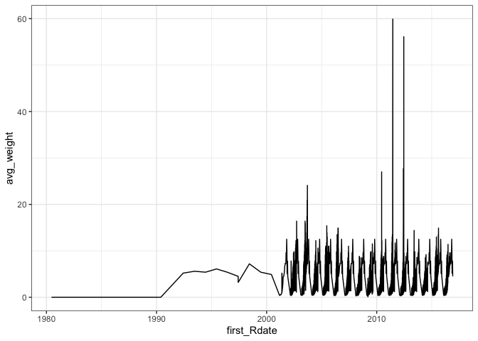

S3 Model Data Types Exploration
================
Maddee Rubenson (FlowWest)
2024-12-30

## FISH

The `FISH.rda` data object which is 2798 rows. See specifics on data
below.

``` r
FISH |> 
  head() |> 
  knitr::kable()
```

| UnitNum | Source   | runType | Total_released | avg_length | avg_weight | brood_year | first_Rdate | last_Rdate |
|--------:|:---------|:--------|---------------:|-----------:|-----------:|-----------:|:------------|:-----------|
|     932 | Bogus Cr | FACH    |         222816 |         39 |        0.5 |       2001 | 2002-03-24  | 2002-03-30 |
|     932 | Bogus Cr | FACH    |        1112391 |         38 |        0.5 |       2001 | 2002-03-31  | 2002-04-06 |
|     932 | Bogus Cr | FACH    |        1306329 |         39 |        0.5 |       2001 | 2002-04-07  | 2002-04-13 |
|     932 | Bogus Cr | FACH    |         230956 |         41 |        0.6 |       2001 | 2002-04-14  | 2002-04-20 |
|     932 | Bogus Cr | FACH    |          35273 |         42 |        0.7 |       2001 | 2002-04-21  | 2002-04-27 |
|     932 | Bogus Cr | FACH    |         183328 |         42 |        0.7 |       2001 | 2002-04-28  | 2002-05-04 |

**UnitNum**

There are 9 unique unit numbers in the `FISH` dataset

``` r
summary(FISH$UnitNum)
```

    ##    Min. 1st Qu.  Median    Mean 3rd Qu.    Max. 
    ##     930    1060    2133    1744    2308    2308

``` r
unique(FISH$UnitNum)
```

    ## [1]  932  930 1242 2205 2132 2133 1436 1060 2308

**Source**

``` r
unique(FISH$Source)
```

    ## [1] "Bogus Cr"  "IGH"       "Salmon R"  "Scott R"   "Shasta R"  "Trinity H"
    ## [7] "Trinity R"

**runType**

The only run type is `FACH`

*TODO* get definition

``` r
unique(FISH$runType)
```

    ## [1] "FACH"

**Total_released**

*TODO* question - data seems inconsistent temporally and the range from
1980-2000 vs. 2000 to 2005

``` r
summary(FISH$Total_released)
```

    ##     Min.  1st Qu.   Median     Mean  3rd Qu.     Max. 
    ##        0      811     5394   107927    32829 12204669

``` r
FISH |> 
  ggplot() + 
  geom_line(aes(x = first_Rdate , y = Total_released))
```

<!-- -->

``` r
FISH |> 
  ggplot() + 
  geom_line(aes(x = last_Rdate , y = Total_released))
```

<!-- -->

**avg_length**

``` r
summary(FISH$avg_length)
```

    ##    Min. 1st Qu.  Median    Mean 3rd Qu.    Max. 
    ##    5.00   47.00   58.00   62.16   78.00  158.00

``` r
FISH |> 
  ggplot() + 
  geom_line(aes(x = first_Rdate , y = avg_length))
```

<!-- -->

**avg_weight**

``` r
summary(FISH$avg_weight)
```

    ##    Min. 1st Qu.  Median    Mean 3rd Qu.    Max. 
    ##   0.000   1.000   2.000   3.523   5.400  59.900

``` r
FISH |> 
  ggplot() + 
  geom_line(aes(x = first_Rdate , y = avg_weight))
```

<!-- -->

**brood_year**

``` r
summary(FISH$brood_year)
```

    ##    Min. 1st Qu.  Median    Mean 3rd Qu.    Max. 
    ##    1979    2004    2008    2008    2012    2015

``` r
FISH |> 
  group_by(brood_year) |> 
  summarize(n = length(brood_year)) |> 
  ggplot() + 
  geom_col(aes(x = brood_year, y = n))
```

<!-- -->

**first_Rdate and last_Rdate**

``` r
summary(FISH$first_Rdate)
```

    ##         Min.      1st Qu.       Median         Mean      3rd Qu.         Max. 
    ## "1980-06-16" "2005-07-03" "2009-07-12" "2009-04-20" "2013-04-14" "2016-11-27"

``` r
summary(FISH$last_Rdate)
```

    ##         Min.      1st Qu.       Median         Mean      3rd Qu.         Max. 
    ## "1980-06-16" "2005-07-09" "2009-07-18" "2009-04-26" "2013-04-20" "2016-12-03"

## FLOWS

There are 509448 rows of date in the `FLOWS` data object

``` r
FLOWS |> 
  head(20) |> 
  knitr::kable()
```

| Date       | Location          | Location_km | Flow |
|:-----------|:------------------|------------:|-----:|
| 1960-10-01 | Klamath.Near.Keno |    378.2373 | 1050 |
| 1960-10-02 | Klamath.Near.Keno |    378.2373 | 1050 |
| 1960-10-03 | Klamath.Near.Keno |    378.2373 | 1050 |
| 1960-10-04 | Klamath.Near.Keno |    378.2373 | 1030 |
| 1960-10-05 | Klamath.Near.Keno |    378.2373 | 1020 |
| 1960-10-06 | Klamath.Near.Keno |    378.2373 | 1020 |
| 1960-10-07 | Klamath.Near.Keno |    378.2373 | 1020 |
| 1960-10-08 | Klamath.Near.Keno |    378.2373 | 1030 |
| 1960-10-09 | Klamath.Near.Keno |    378.2373 | 1040 |
| 1960-10-10 | Klamath.Near.Keno |    378.2373 | 1090 |
| 1960-10-11 | Klamath.Near.Keno |    378.2373 | 1130 |
| 1960-10-12 | Klamath.Near.Keno |    378.2373 | 1140 |
| 1960-10-13 | Klamath.Near.Keno |    378.2373 | 1160 |
| 1960-10-14 | Klamath.Near.Keno |    378.2373 | 1180 |
| 1960-10-15 | Klamath.Near.Keno |    378.2373 | 1210 |
| 1960-10-16 | Klamath.Near.Keno |    378.2373 | 1210 |
| 1960-10-17 | Klamath.Near.Keno |    378.2373 | 1190 |
| 1960-10-18 | Klamath.Near.Keno |    378.2373 | 1160 |
| 1960-10-19 | Klamath.Near.Keno |    378.2373 | 1000 |
| 1960-10-20 | Klamath.Near.Keno |    378.2373 | 1150 |

**Date**

``` r
summary(FLOWS$Date)
```

    ##         Min.      1st Qu.       Median         Mean      3rd Qu.         Max. 
    ## "1960-10-01" "1975-04-12" "1989-10-22" "1989-10-22" "2004-05-03" "2018-11-12"

**Location**

``` r
unique(FLOWS$Location)
```

    ##  [1] "Klamath.Near.Keno"                 "Klamath.Top.of.JC.Boyle.Reservoir"
    ##  [3] "Klamath.Below.JC.Boyle.PP"         "Klamath.Below.Copco1.Dam"         
    ##  [5] "Klamath.Below.Iron.Gate"           "Klamath.Willow"                   
    ##  [7] "Klamath.Cottonwood"                "Klamath.Shasta"                   
    ##  [9] "Klamath.Humbug"                    "Klamath.Beaver"                   
    ## [11] "Klamath.Dona"                      "Klamath.Horse"                    
    ## [13] "Klamath.Scott"                     "Klamath.Near.Seiad.Valley"        
    ## [15] "Klamath.Indian.Creek"              "Klamath.Elk"                      
    ## [17] "Klamath.Clear"                     "Klamath.Salmon"                   
    ## [19] "Klamath.At.Orleans"                "Klamath.Red.Cap"                  
    ## [21] "Klamath.Bluff"                     "Klamath.Trinity"                  
    ## [23] "Klamath.Blue"                      "Klamath.Near.Klamath"

**Location_km**

``` r
summary(FLOWS$Location_km)
```

    ##    Min. 1st Qu.  Median    Mean 3rd Qu.    Max. 
    ##   13.65  104.78  237.03  212.67  299.89  378.24

**Flow**

``` r
FLOWS |> 
  ggplot() + 
  geom_line(aes(x = Date, y = Flow)) + 
  facet_wrap(~Location)
```

<!-- -->

## HABAREA

There are 263500 rows of data in `HABAREA` data object

``` r
HABAREA |> head(20) |> knitr::kable()
```

| UnitNum | Flow_cfs | totArea_m2 |    spn_m2 |    fry_m2 |   juv_m2 |
|--------:|---------:|-----------:|----------:|----------:|---------:|
|       1 |     0.00 |      0.000 |    0.0000 |  0.000000 | 0.000000 |
|       1 |   206.00 |   1727.870 |  984.5681 | 10.117282 | 3.735946 |
|       1 |   249.00 |   1841.270 | 1057.2326 | 10.524197 | 3.959563 |
|       1 |   259.00 |   1687.338 |  983.0289 |  9.191307 | 3.590523 |
|       1 |   272.00 |   1676.386 |  982.5201 |  8.944078 | 3.551479 |
|       1 |   283.00 |   1720.930 | 1005.4288 |  9.108645 | 3.641905 |
|       1 |   298.76 |   1785.453 | 1041.3440 |  9.410795 | 3.776352 |
|       1 |   321.00 |   1864.428 | 1085.1389 |  9.776988 | 3.940719 |
|       1 |   335.68 |   1916.035 | 1113.4960 | 10.010507 | 4.047819 |
|       1 |   352.00 |   1967.048 | 1140.8667 | 10.226765 | 4.152907 |
|       1 |   376.00 |   2041.415 | 1181.7079 | 10.562787 | 4.307214 |
|       1 |   403.00 |   2121.387 | 1225.1804 | 10.914260 | 4.472625 |
|       1 |   416.00 |   2148.411 | 1235.6457 | 10.939685 | 4.523542 |
|       1 |   433.00 |   2160.632 | 1230.3757 | 10.730188 | 4.534780 |
|       1 |   450.00 |   2172.964 | 1225.2064 | 10.522065 | 4.546297 |
|       1 |   465.40 |   2162.818 | 1201.8663 | 10.083653 | 4.504308 |
|       1 |   481.00 |   2171.366 | 1194.1740 |  9.848609 | 4.507448 |
|       1 |   500.00 |   2202.266 | 1202.7634 |  9.803071 | 4.561688 |
|       1 |   517.00 |   2228.810 | 1209.8199 |  9.756839 | 4.607903 |
|       1 |   538.00 |   2269.988 | 1225.5849 |  9.826637 | 4.682390 |

**UnitNum**

*TODO* are these unit numbers the same as those in `FISH`? This dataset
contains sequential unit numbers from 1 to 2635

``` r
summary(HABAREA$UnitNum)
```

    ##    Min. 1st Qu.  Median    Mean 3rd Qu.    Max. 
    ##       1     659    1318    1318    1977    2635

**FLow_cfs**

``` r
summary(HABAREA$Flow_cfs)
```

    ##    Min. 1st Qu.  Median    Mean 3rd Qu.    Max. 
    ##       0    1285    2311    5617    5013  112901

``` r
HABAREA |> 
  ggplot() + 
  geom_line(aes(x = UnitNum, y = Flow_cfs))
```

<!-- -->

**totArea_m2**

``` r
summary(HABAREA$totArea_m2)
```

    ##    Min. 1st Qu.  Median    Mean 3rd Qu.    Max. 
    ##       0    2460    5399    9270   10980  375217

``` r
HABAREA |> 
  ggplot() + 
  geom_line(aes(x = UnitNum, y = totArea_m2))
```

<!-- -->

**spn_m2**

``` r
summary(HABAREA$spn_m2)
```

    ##    Min. 1st Qu.  Median    Mean 3rd Qu.    Max. 
    ##     0.0   289.2   816.5  1456.3  1838.9 43920.4

``` r
HABAREA |> 
  ggplot() + 
  geom_line(aes(x = UnitNum, y = spn_m2))
```

<!-- -->

**fry_m2**

``` r
summary(HABAREA$fry_m2)
```

    ##     Min.  1st Qu.   Median     Mean  3rd Qu.     Max. 
    ##    0.000    1.505    4.975   26.006   17.443 1873.547

``` r
HABAREA |> 
  ggplot() + 
  geom_line(aes(x = UnitNum, y = fry_m2))
```

<!-- -->

**juv_m2**

``` r
summary(HABAREA$juv_m2)
```

    ##     Min.  1st Qu.   Median     Mean  3rd Qu.     Max. 
    ##   0.0000   0.9164   3.8094  12.4849  12.1753 667.9280

``` r
HABAREA |> 
  ggplot() + 
  geom_line(aes(x = UnitNum, y = juv_m2))
```

<!-- -->

## HABITAT
